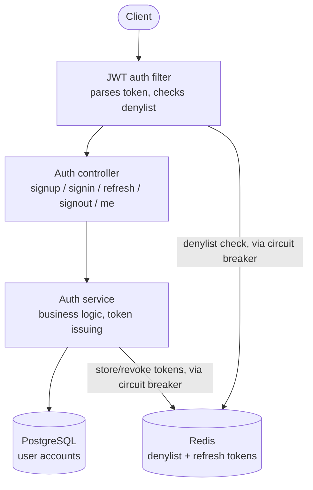

# Sawiya Auth Service

A JWT-based User Authentication REST API built in Java 17 / Spring Boot 3, submitted for
the Sawiya Backend Developer (Java / Spring Boot) technical assignment.

Signup, signin, refresh, signout, and "who am I", with short-lived access tokens, rotating
refresh tokens, Redis-backed revocation protected by a circuit breaker, and CSRF-protected
cookie sessions.

## Endpoints

| Method | Path | Description |
|--------|------|-------------|
| POST | `/api/auth/signup` | Create an account |
| POST | `/api/auth/signin` | Log in, get an access + refresh token pair |
| POST | `/api/auth/refresh` | Rotate the token pair |
| POST | `/api/auth/signout` | Revoke both tokens |
| GET | `/api/auth/me` | Current user's identity |

## How a request flows



Redis calls go through a Resilience4j circuit breaker: if Redis is unreachable, reads fail
open (a user isn't locked out mid-outage) and writes fail soft (signin/signout still
succeed) — see the full README below for the reasoning.

## Quick start

```bash
docker compose up -d          # Postgres + Redis
cd auth-service
copy src\main\resources\application-secrets.properties.example src\main\resources\application-secrets.properties
# edit application-secrets.properties with real values
mvn spring-boot:run "-Dspring-boot.run.profiles=secrets"
```

```bash
mvn clean test    # 18 tests: unit, integration, and circuit-breaker resilience
```

## Tech stack

Java 17 · Spring Boot 3 · Spring Security 6 · Spring Data JPA · PostgreSQL · Redis ·
Resilience4j · JJWT · JUnit 5 / Mockito · Docker Compose

## Full documentation

**[auth-service/README.md](auth-service/README.md)** has the complete picture: design
rationale for every decision (why no ID token, why Redis over a DB table, why the refresh
cookie is scoped the way it is), the CSRF and circuit-breaker mechanics in detail, the full
configuration reference, and a manual curl walkthrough.
